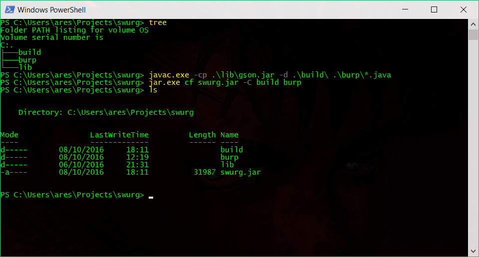
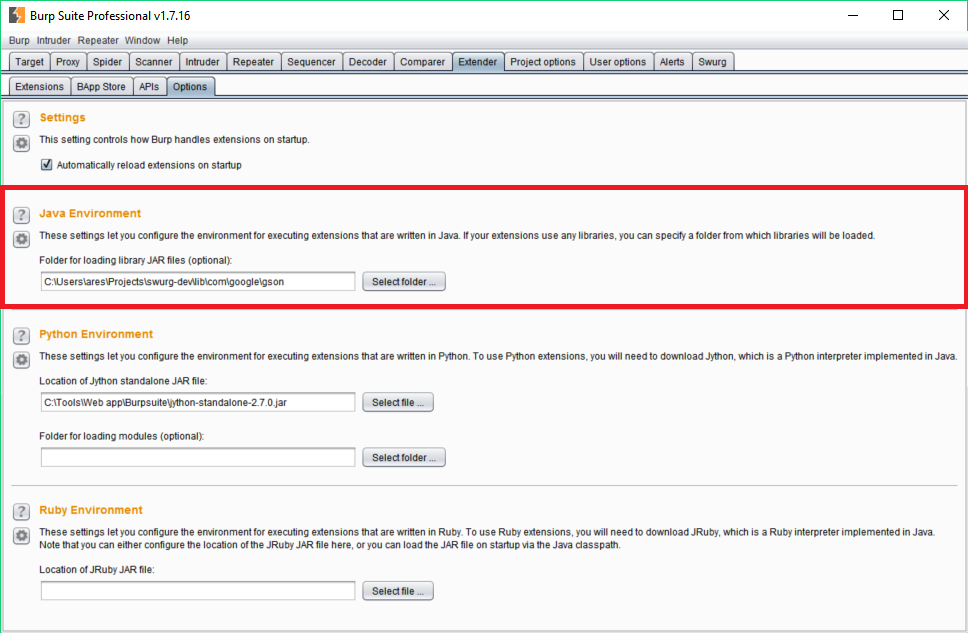

# swurg
## A Burp extension for REST API testing.

During engagement involving REST API, it is often a real pain and lost of time to chain Burp with other tool such as SOAP-UI just to parse the Swagger. Therefore, after posting a request on the PortSwigger support forum (<https://support.portswigger.net/customer/portal/questions/16358278-swagger-parser-and-wsdler-improvement>) more than 4 months ago, I have just decided to take the lead and try to implement my first Burp extension.

Please note, that the project is not completed yet. I am still developing it and any feedback would of course be welcome. At the moment, only the parsing of inBody parameter should be implemented and the code optimized in order to have a stable first version of the extension.

The following screenshot shows the plugin interface, for obvious reason the screenshot does not present any sensitive information:

## Features
* Parse Swagger files.
* Responsive GUI.
* Send requests to the active scanner.
* Send requests to the repeater
* Send requests to the intruder.

## Installation
### Compilation
1. Download the repositiory.

2. Add the gson jar inside the lib folder.

2. Compile the source and set the classpath:

		$ javac.exe -cp .\lib\gson.jar -d .\build\ .\burp\*.java

3. Create the swurg jar file:

		$ jar.exe cf swurg.jar -C build burp

### Burp settings
1. Under the Burp Extender/Options tab, set the Java Environement to the lib folder containing the gson library.

2. Under the Burp Extender/Extensions tab, click on the Add button and load the swurg jar. 

## Dependencies
### Third-party libraries
#### google-gson:
The *google-gson* library is required. 

<http://repo1.maven.org/maven2/com/google/code/gson/gson/2.7/>

## License
   Copyright (C) 2016 Alexandre Teyar

Licensed under the Apache License, Version 2.0 (the "License");
you may not use this file except in compliance with the License.
You may obtain a copy of the License at

<http://www.apache.org/licenses/LICENSE-2.0>

Unless required by applicable law or agreed to in writing, software
distributed under the License is distributed on an "AS IS" BASIS,
WITHOUT WARRANTIES OR CONDITIONS OF ANY KIND, either express or implied.
See the License for the specific language governing permissions and
   limitations under the License. 