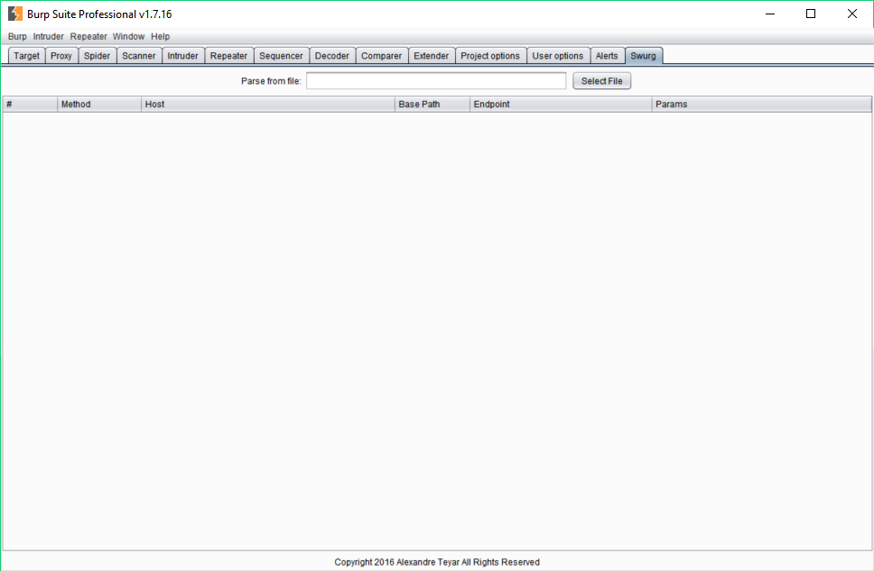

# swurg
## A Burp extension for RESTful API testing.
During penetration testing of RESTful API, it can be time consuming to chain Burp with other tools such as SOAP-UI. However, this is often necessary in order to parse the API description for use with Burp's scanning capabilities. 

Therefore, after posting a request for improvement on the PortSwigger support forum, see <https://support.portswigger.net/customer/portal/questions/16358278-swagger-parser-and-wsdler-improvement>, in July 2015, I decided to take the lead and implement a solution myself.

The following screenshot shows the plugin interface, for obvious reasons the screenshot does not present any sensitive information:

## Project information
The extension is still in development, feedback and comments would be much appreciated.

## Features
* Parse Swagger JSON files (YAML files are not supported at the moment).
* Responsive GUI.
* Send requests to the active scanner.
* Send requests to the intruder.
* Send requests to the repeater.

## Installation
### Compilation 
#### Windows & Linux
1. Install gradle (https://gradle.org/)

2. Download the repository.

        $ git clone https://github.com/AresS31/swurg
        $ cd .\swurg\

3. Create the swurg jarfile:

        $ gradle fatJar
        
### Burp settings
1. In Burp, under the `Extender/Options` tab, click on the `Add` button and load the swurg-all jarfile. 

## Dependencies
### Third-party libraries
#### google-gson:
The *google-gson* library is required and included in this repository. 

<https://repo1.maven.org/maven2/com/google/code/gson/gson/2.8.0/>

## License
   Copyright (C) 2016 Alexandre Teyar

Licensed under the Apache License, Version 2.0 (the "License");
you may not use this file except in compliance with the License.
You may obtain a copy of the License at

<http://www.apache.org/licenses/LICENSE-2.0>

Unless required by applicable law or agreed to in writing, software
distributed under the License is distributed on an "AS IS" BASIS,
WITHOUT WARRANTIES OR CONDITIONS OF ANY KIND, either express or implied.
See the License for the specific language governing permissions and
   limitations under the License.
